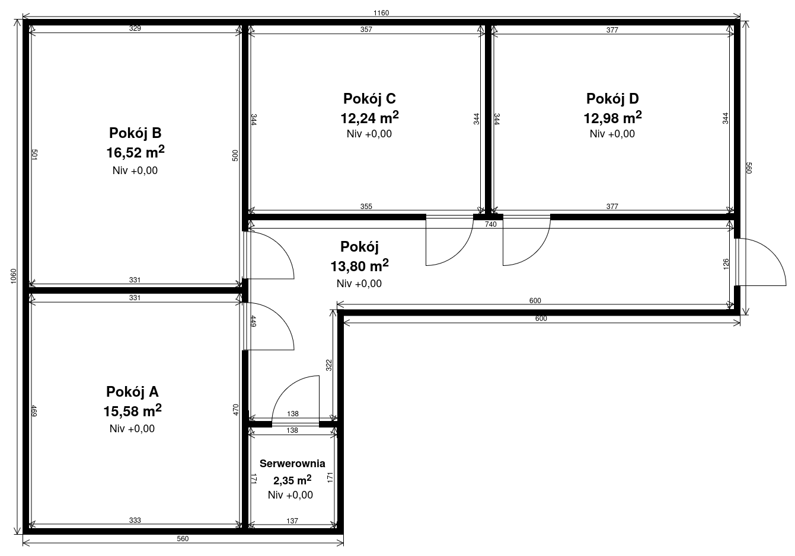
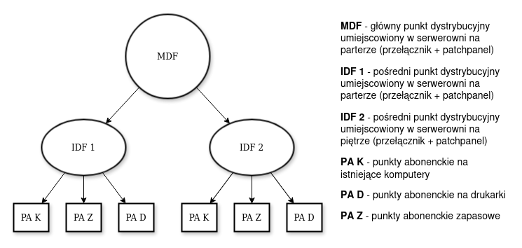

# Projekt sieci fizycznej i logicznej budynku dwukondygnacyjnego

To repozytorium zawiera projekt sieci komputerowej oraz projekt logiczny sieci komputerowej dla budynku dwukondygnacyjnego.

## Zadanie

Zadanie pochodzi z podręcznika do przygotowania do kwalifikacji INF.02 Jarosława Orczykowskiego i Artura Rudnickiego.

### Treść zadania

Wykonaj projekt sieci fizycznej i logicznej dla przedstawionego projektu budynku dwukondygnacyjnego (kondygnacje są identyczne, a schody pomijamy). W każdym z pomieszczeń powinny pracować po dwa komputery oraz drukarka sieciowa. Parter i piętro powinny mieć osobne podsieci. W budynku wydzielone są miejsca na serwerownie.

### Wizualizacja kondygnacji

**Wymagania:**
- W każdym pomieszczeniu:
  - 2 komputery,
  - 1 drukarka sieciowa,
- Serwerownia na każdym piętrze.

---

## Zawartość repozytorium

### 1. Projekt fizyczny
- [`projekt-sieci-komputerowej.docx`](projekt-fizyczny/projekt-sieci-komputerowej.docx) – projekt sieci komputerowej w formacie docx.
- [`projekt-sieci-komputerowej.pdf`](projekt-fizyczny/projekt-sieci-komputerowej.pdf) – projekt sieci w formacie pdf.

#### Projekt zawiera:
- [`schemat-okablowania.png`](projekt-fizyczny/obrazy/schemat-okablowania.png) - wizualizacja kondygnacji z naniesionym okablowaniem poziomym.
- [`rozmieszczenie-punktow-dystrybucyjnych-i-abonenckich.png`](projekt-fizyczny/obrazy/rozmieszczenie-punktow-dystrybucyjnych-i-abonenckich.png) - wizualizacja budynku z naniesionymi punktami gniazdami oraz dystrybucyjnymi.
- [`diagram-struktury-logicznej.png`](projekt-fizyczny/obrazy/diagram-struktury-logicznej.png) - uproszczona forma diagramu struktury logicznej sieci.

### 2. Projekt logiczny
- [`projekt-logiczny.pkt`](projekt-logiczny/projekt-logiczny.pkt) - projekt logiczny sieci stworzony w Cisco Packet Tracer.
- [`projekt-logiczny.png`](projekt-logiczny/projekt-logiczny.png) - projekt logiczny sieci w formacie PNG.

---

## Technologie i narzędzia

W trakcie realizacji projektu wykorzystano:
- **Google Docs** – do tworzenia projektu,
- **draw.io** – do projektowania wizualizacji budynku,
- **Cisco Packet Tracer** – do projektowania sieci logicznej.

---

## Jak uruchomić projekt?

1. **Kosztorys**:
   - Otwórz plik Word (`.xlsx`) lub wersję PDF (`.pdf`), aby zapoznać się z projektem.
2. **Projekt budynku**:
   - Plik `.drawio` można edytować w narzędziu [draw.io](https://app.diagrams.net/).
   - Alternatywnie, przejrzyj wizualizację w formacie PNG.
3. **Projekt logiczny sieci**:
   - Otwórz plik `.pkt` za pomocą [Cisco Packet Tracer](https://www.netacad.com/courses/packet-tracer).
   - Możesz również zobaczyć podgląd diagramu w formacie PNG.

---

## Podgląd projektu

### Diagram struktury logicznej

### Rozmieszczenie punktów abonenckich i dystrybucyjnych:

### Diagram logiczny sieci:

---

## Kontakt

Jeśli masz pytania lub uwagi dotyczące projektu, zapraszam do kontaktu poprzez [LinkedIn](https://linkedin.com/in/smichajlidis) lub [GitHub](https://github.com/smichajlidis).

---
